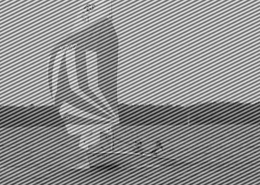

This folder contains a small demo of removing periodic noise from an image using a 2D Fourier Transform. 
I took the Fourier Transform of the image and identified the frequencies with noise. Then, I reduced the magnitude of those values in frequency space, before taking the inverse transform to get the original image without the noise.
A gif transitioning from the original to the processed image is shown below:

