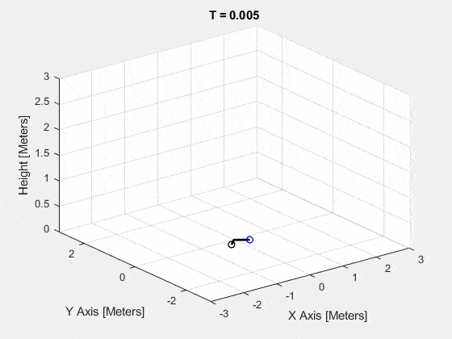

# Quadcopter Flight Controller Design

This folder contains work from a class where I created a model of a quadcopter, and designed and simulated a linear flight controller for it. This semester was the Spring 2020 semester when everything got shut down, and due to the chaos I was unfortunately not able to get the controller to work on the physical drone.

Each of the first six assignment folders include work I completed toward deriving the system dynamics, creating models, and analyzing outputs of sensors. They contain the MATLAB and Simulink files I used in the assignment, along with a PDF writeup of my work and findings.

The last subfolder contains the full simulation of the nonlinear dynamics with controllers. These three assignments were completed as part of a group, with Ethan Cuka, Clay Whipp and Jockabeth Ponce. Some of the files state someone's name, as the group used their work as a starting point (for example, we used my Simulink model since it was the cleanest), but the workload was shared and discussed as a group. Instead of a writeup, I recorded three short videos to summarize my work for these three assignments, linked below:

- Assignment 7 (Simulated Flight): https://youtu.be/AXaAB7tSJRI
- Assignment 8 (System Identification): https://youtu.be/3JMsl59doIs
- Assignment 9 (Simulated Flip and Orbit): https://youtu.be/uZ0dNedevtY

A short gif of the flip simulation is shown below as well.

