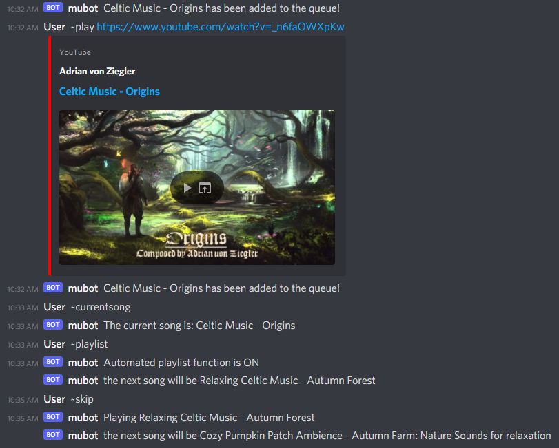
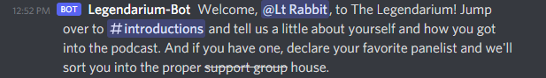
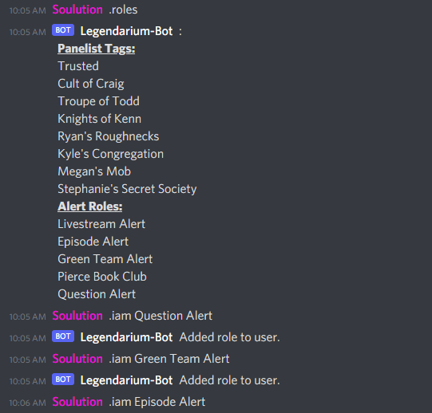
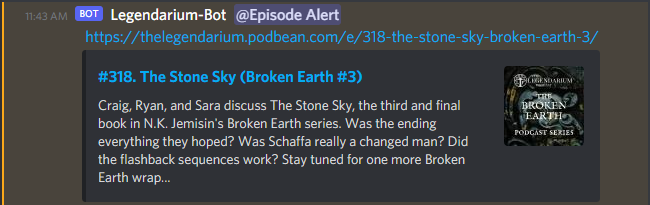
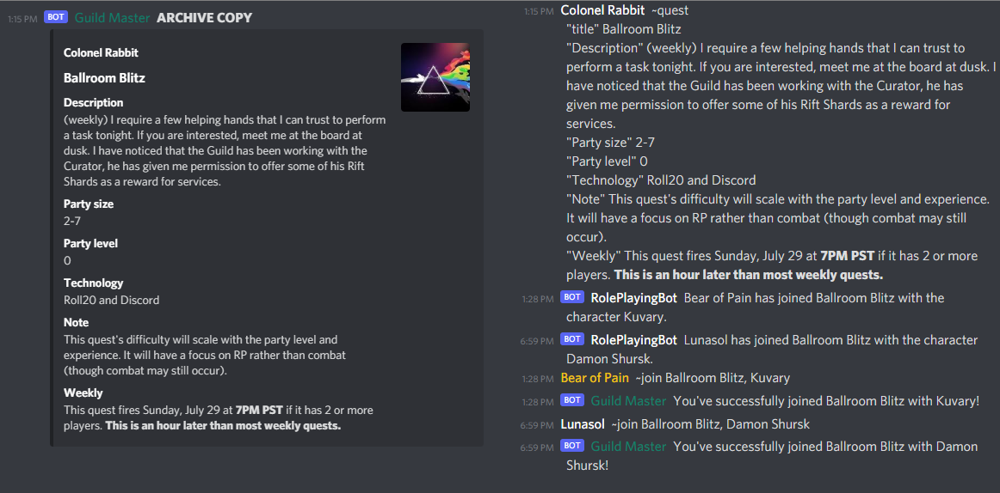
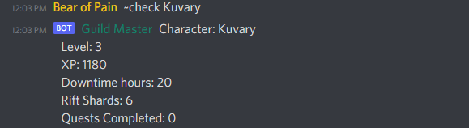
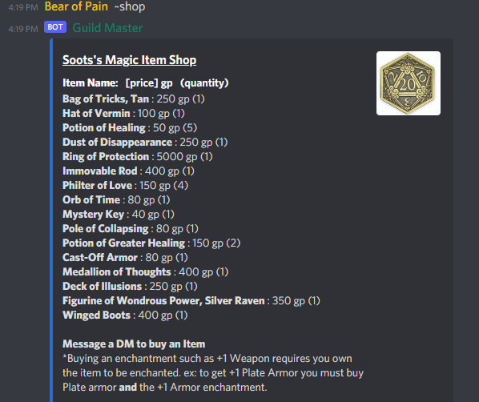

# Discord.js Bots

This folder shows the three main bots I wrote for various servers with the Discord API using Node.js. For each program, I have included descriptions, the main \*.js files, and some screenshots of the bot working. They are

- <b>music_bot:</b> This bot plays audio from YouTube videos using the ytdl-core package. It has two modes: normal mode, where the users manually add videos to the queue, and it goes through them in order; and automated playlist mode, where it randomly picks the next video from the Related Videos streamed through ytdl-core.

-  <b>legendarium_bot:</b> This bot is the only one of the three that I'm currently still using. It is used to send welcome messages and manage notifications for the Legendarium Podcast's Discord server. It gives opt-in roles to members when asked, sends a message whenever a new user joins the server, and posts and alert whenever a new episode of the podcast has been released. Examples of the three functions are shown below.

- <b>rpg_server_bot:</b> This bot was used to help manage a "Westmarch D&D Campaign", an open-to-all Dungeons and Dragons group with multiple game masters where you sign up for individual sessions, or "quests", only when you have time with no weekly commitments. The bot managed quest listings, sending out announcements and notifications to players and game masters related to quests they were a part of, as well as keeping track of characters and their in-game resources. Information was stored in a SQL database, and was accessed/updated using PHP commands from a Node.js library.

